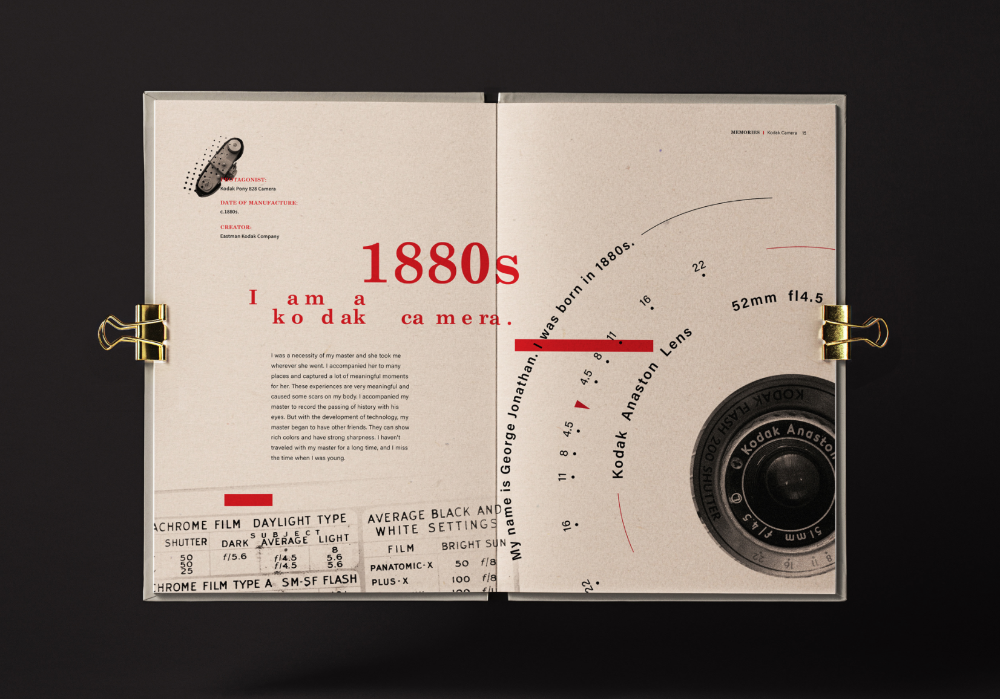
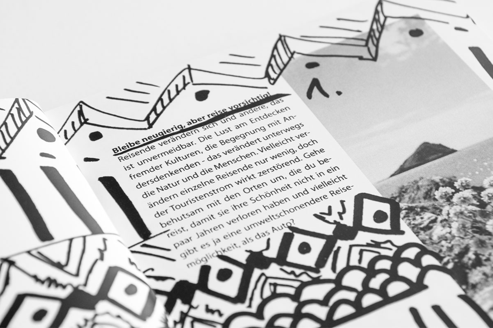
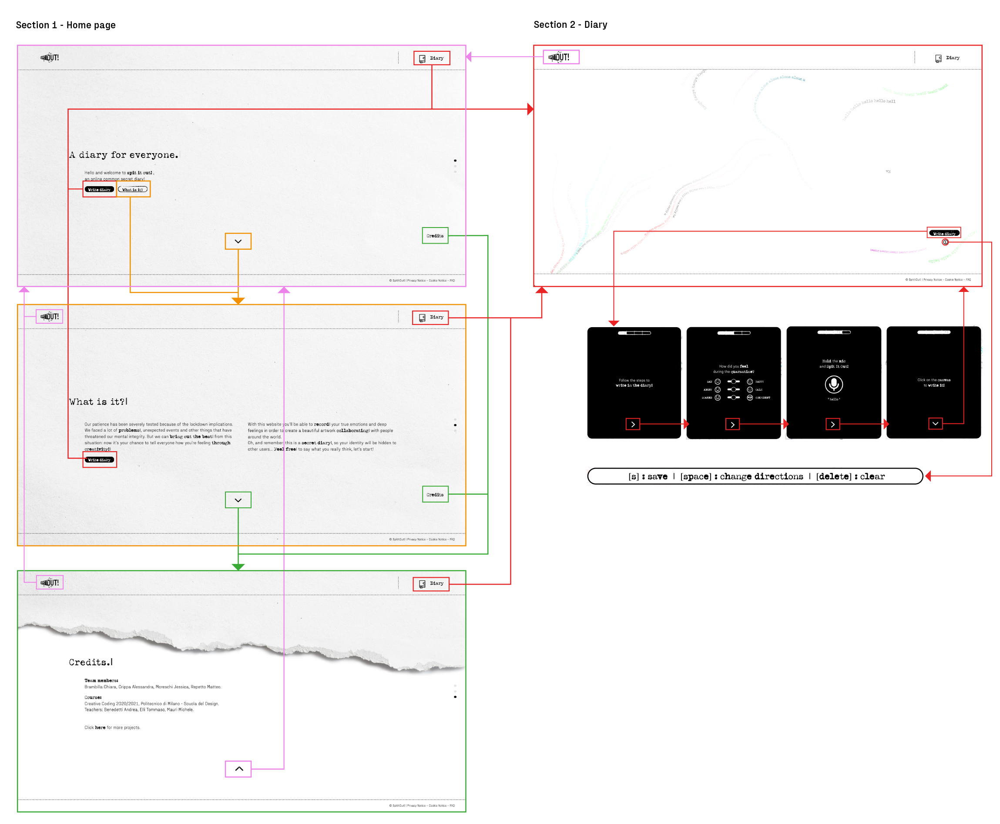
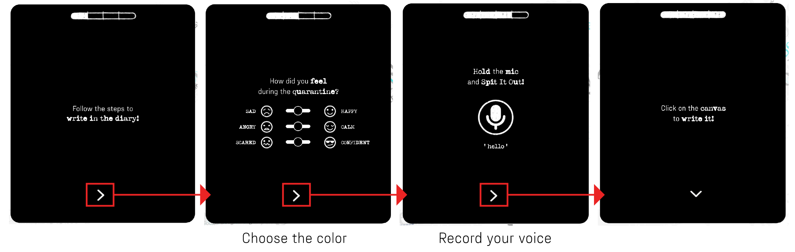

<p align="center">
  
</p>

### Team members:
-  Brambilla Chiara
-  Crippa Alessandra
-  Moreschi Jessica
-  Repetto Matteo

### Course
[Creative Coding 2020/2021](https://drawwithcode.github.io/2020/)<br>
**Politecnico di Milano** - Scuola del Design<br>
**Faculty:** Michele Mauri, Andrea Benedetti, Tommaso Elli.


## Concept

Our patience has been severely tested because of the lockdown implications. We faced a lot
of different problems, unexpected events and other things that have threatened our mental
integrity. But we can bring out the best from this situation: Now it’s your chance to tell
everyone how you’re feeling… through creativity!

We present you... **Spit It Out!**
 This phrase is used as an invite to say what you are really thinking (in italian
can be translated as “sputa il rospo”, “sputalo fuori”).

The site is a common space that presents a diary as collaborative canvas: people will create
a masterpiece of “**words traces**”. Step by step, the user will answer some questions
in order to generate a “river of words”. The final result is an artwork in which all
the bad and good feelings dance together.

<p align="center">
  
</p>

In these days it's been very hard to communicate between us about how we are feeling, so the site wants to be useful for all of those people who needs to speak. It doesn't matter what exactly you want to say, the important thing is to say it.
The aim of the project is to give voice to **deep feelings**, whatever they are. Together users
will create an amazing and unpredictable artwork that will be shaped by the interaction of
each other.

The entire experience is designed to work on computer and the mic is required.


## Design Challenges

The concept is communicated with a strong visual identity, which is inspired by hand–drawn sketches in order to express the "diary mood". In fact, the site could be seen as a sort of public diary in which people can write their thoughts without their identity being made public (no login or entering name is necessary).

### Inspirations

The design and visual identity of this project was inspired by some exiting works (not only works about web and internet, but also about graphic design and typography). Here some links and images to discover them:
- [Paper textures](https://www.behance.net/gallery/105236297/Free-Download-8x-Detail-Paper-Texture-Collection?tracking_source=search_projects_recommended%7Cfree%20paper%20texture) by **Freeject.net Design**
- [Elude](https://www.behance.net/gallery/108994253/Elude) by **Herman Scheer**
- [Travel Bug](https://www.behance.net/gallery/38800427/Travel-Bug?tracking_source=search%7Cquotes) by **Lara Resch**
- [Memories Book Design](https://www.behance.net/gallery/106580687/Memories-Book-Design?tracking_source=search_projects_recommended%7Csecret%20book) by **Wanran Ding**

<p float="left">
  
  
  
</p>  

### Visual identity

**Logo** <br>
The logo is composed by two aspects: the title of the site (Spit It Out) and a stylized megaphone, that
represents the voice (a key element of the experience). Another characteristic is the applied texture, which gives an hand drawn look. <br>
There is also an alternative versione of the logo with only the initial letters S.I.O. (used as the site's favicon).
<p align="center" float="left">
 
 
</p>


**Palette and textures** <br>
The color palette is very simple, composed by only two main colors (black and white) which resembles **ink**
and **paper**. The two textures too were selected to remember paper and ink.

<p align="center">
 
</p>

**Fonts** <br>
The site uses two different fonts: the one called "**Fraktion Sans**" is used in standard texts, the other one called "**Typeka**", instead, is used in titles and underlined words (and it recalls typewriter's letters).

<p align="center">
 
</p>

**Animations** <br>
Last but not the least, there's the large use of animations. They have been realized to be used as hover (so they can be triggered by passing the mouse on it) or as simple visual effects (such as the titles of the sections). All these animations follow the previous rules of the visual identity.
<p float="left" align="center">
         
   
   
   
</p>

### UX

The UX have been designed to be simple and easily understood. The site presents two main sections: one is "**Home page**" (reachable in any moment by pressing on the button with site's logo settled in the top-left of the page), in which you can find a welcome message, informations about what kind of site it is and the credits. The other one section is called "**Diary**" (reachable by pressing the diary in the top-right part of the site or the button "write in the diary" in the Home page) is the common space where you can find the messages left by other users around the world. Users can intercat with the canvas by pressing some keyboard's buttons: **Spacebar** change the direction of traces, **S** print the canvas as a png file and **Delete** refresh the canvas. All these informations are visible by pressing the button "**i**" under the button "write in the diary".

<p align="center">
  
</p>

Users can insert their own messages by pressing the button "Write in the diary" settled in the section Diary. If clicked, a window will appear and step by step it will be explained how to insert a message:
- First it will be asked how they felt during the quarantine. Depending on the emotions chosen by moving the sliders, the stroke of the sentence will assume a certain **color** (each slider is releated to a specific channel of the colour method RGB).
- Second it will be asked to "spit it out" what thay are really feeling by holding with the mouse the mic icon. The volume level will affect the size of the words that will appear on the canvas.
- As third and final step it will be asked to click on the canvas of the site to see the final result.

<p align="center">
  
</p>


## Code challenges
<ol>
  <li>  

<b>Preload sentences</b><br>
First, it has been necessary to understand how to preserve all the sentences that users have left in the canvas. Therefore, it was necessary to store them in a server. The solution? Use "**Firebase** server". Firebase is a Google's platform that helps to develop apps in a high-quality way; it has a lot of interesting functions, such as the possibility to store data given by users and control them (for example, you can delete or modify them). <br>

That's how it was introduced in the code: the  function **gotData()** is called in the **setup()** with the function **texts.once("value", gotData)**, which provides the access to the Firebase storage. Then, for each element (called "**keys**") of the database array, it creates a new "agent" (sentence that will appear in the canvas) with defined parameters for the Agent constructor (mouse position, personalized colour, text and font size) picked from Firebase's storage.
```javascript
function gotData(data) { //load data from server
  let texts = data.val(); //The val() function returns an object.
  let keys = Object.keys(texts); // Grab the keys to iterate over the object
  agentCount = keys.length;
  // console.log("gotData: " + agentCount)
  for (let i = 0; i < keys.length; i++) { //for each object
    let userText = texts[keys[i]]; //assign his data to let userText
    agents[i] = new Agent(userText.xPos, userText.yPos, color(userText.rCol, userText.gCol, userText.bCol), userText.letters, userText.vol_text);
  }
}
```

  </li>

  <li>

<b>Update sentences</b> <br>
Another challenge related to the previous one was to make visible the changes made by other users in real time. This means that the database must be constantly checked, but only the last element of the array must be loaded on change. <br>

So, the function **texts.on("value", updateData)** have been introduced. This function does a constant check of the firebase database: each time it changes, it triggers the function **updateData()**. This function is the same of the previous one (**gotData()**): the difference is that it creates a new **agent** only for the last element of the firebase database array (it means that each time a new sentence is stored, it will appear on the everyone's canvas).
```javascript
function updateData(data) { //update text list
  let texts = data.val();
  let keys = Object.keys(texts);
  agentCount = keys.length;
  //  console.log("updateData: " + agentCount)
  for (let i = keys.length - 1; i < keys.length; i++) { //select last object
    let userText = texts[keys[i]];
    agents[i] = new Agent(userText.xPos, userText.yPos, color(userText.rCol, userText.gCol, userText.bCol), userText.letters, userText.vol_text);
  }
}
```

  </li>

  <li>

<b>Speech recognition</b><br>
For this part, it has been introduced the libray "**p5.speech**", a speech synthesis recognition for p5.js.
It consists of an object class (p5.SpeechRec) along with an accessor function to listen for text, change parameters such as recognition models, etc.

**"Continuous"** propriety is a **boolean** to set whether the speech recognition engine will give results continuously (**true**) or just once (**false = default**); instead, the propriety "**Interim**" is a boolean that deserve to determine whether the speech recognition engine will give faster, partial results (**true**) or wait for the speaker to pause (**false = default**). Another code's feature related to audio is that the font's size is determined by the microphone (higher the voice's volume is, bigger the font will be) and this thanks by the class **new p5.AudioIn()**, which takes the volume level (it is based on the  p5.sound library).
```javascript
function startMic() {
  vol_zero = vol_map;
//  console.log("listening");

  //mic.start();
  let continuous = false; //continue recording
  let interim = false;
  spoke = true;
  speechRec.start(continuous, interim);
  document.getElementById('panel').contentWindow.document.getElementById('micBtn').style.backgroundImage = "url('../assets/image/04.2_Mic.gif')"
}
```

```javascript
function gotSpeech() {
  if (speechRec.resultValue) {
    let text = speechRec.resultString;
    letters = text + ' ';
    let phrase = document.getElementById('panel').contentWindow.document.getElementById('phrase');
    phrase.innerHTML = "' " + speechRec.resultString + " '"
    phrase.style.padding = '0 20px 20px 20px';
   console.log(speechRec.resultString)
  console.log("sono nella funzione gotspeech");
  }
}
```
  </li>

  <li>

<b>How to represent each phrase: Agent class</b><br>
One of the main project's point was facing the challenge of writing people’s thoughts on the canvas with **Perlin noise**.
In order to do so, a new **class Agent** has been created. It represents the beginning of each sentence (which moves randomly at each frame) and contains the current position, the words of the entire phrase, the color, the size, and other parameters.
```javascript
class Agent{
  constructor(x0,y0, color, string, vol){
    this.pos = createVector(x0, y0); //current position
    this.nextPos = this.pos.copy(); //next position
    this.stepSize = random(1, 5); //step at each frame
    this.isOutside = false; //it tells if a sentence has reachd the edge of the canvas
    this.angle; //angle of the new position (with Perlin noise)
    this.letterIndex = 0; //for printing letters in the right order
    this.col = color;
    this.privateLetters = string;
    this.lettersLength = string.length;
    this.vol = vol;
  }

```

The main method of the Agent class is **update()**, in which a while cycle is aimed at finding the new agents’ position at each frame (in order to print the new letter) and the distance from the previous letter. The angle of the movement direction at each frame is found with Perlin noise.
```javascript
update(noiseScale, noiseStrength, strokeWidth) {
    // It's the method which actually prints the text
    var newLetter = this.privateLetters.charAt(this.letterIndex); //it picks the next letter to be printed
    fill(this.col)
    var d = 0;
    this.pos = this.nextPos.copy();
    textSize(this.vol);

    while(d <= textWidth(newLetter)){
      // This while cicle it's for finding the next position at the right distance from the last letter, in order to print the new letter.
      // It continues until the new position is far enough from the last letter.
      this.angle = noise(this.nextPos.x / noiseScale , this.nextPos.y / noiseScale) * noiseStrength; //the direction of the text's movement is found with Perlin noise
      this.nextPos.x = this.nextPos.x + cos(this.angle) * stepSize; //the new position is computed
      this.nextPos.y = this.nextPos.y + sin(this.angle) * stepSize;
      this.isOutside = this.nextPos.x < 0 || this.nextPos.x > width || this.nextPos.y < 0 || this.nextPos.y > height; //1 if agent has reached the edge, 0 otherwise
      if (this.isOutside) { //when the agent reaches the edge of the canvas is randomly put inside the canvas again
        this.nextPos.set(random(width), random(height));
        this.pos = this.nextPos.copy();
        this.nextPos.x = this.nextPos.x + cos(this.angle) * stepSize;
        this.nextPos.y = this.nextPos.y + sin(this.angle) * stepSize;
        this.letterIndex = 0; //the sentence starts from the beginning
        newLetter = this.privateLetters.charAt(this.letterIndex); //the next letter becomes the first one
      }
      this.isOutside = false;
      d = p5.Vector.dist(this.nextPos, this.pos); //distance of the new position from the last letter
    } //end of while

```

Then, when the new position is sufficiently far from the last letter, the function prints the new letter on the canvas, with a translation and a rotation of the coordinate system.
```javascript
push();
translate(this.pos.x, this.pos.y);
let angle = atan2(this.nextPos.y - this.pos.y, this.nextPos.x - this.pos.x);
rotate(angle);
text(newLetter, 0, 0);
pop();

```
  </li>

  <li>

<b>index.html</b><br>
Last but not least, there was to give a diary-look to some sentences by adding a function that “type-writes” them in **real time**. But the real challenge was to trigger the function **only once** and only when **the user is in the correct section**. <br>

The function **currentSection()** manage to evaluate in which website section the user is: it constantly checks the url and compares it with an if condition. After detecting the section, it calls the right function **type()** (it manages to trigger it only once by a comparison with the previous url).
This last function creates a new element of the class **"Typewriter**" (that generates strings with a typewriter look) and provides sending the methods properties.
```javascript
    let prevUrl = '#firstPage';
    window.setInterval(function currentSection() { //set a draw() function
      let url = window.location.hash; //detect url hash
      if (url == '#firstPage') { //1st page
        if (url != prevUrl) { //run once
          type1();
          prevUrl = url
        }
      }
 ```
 ```javascript
     function type1() {
      sound.play(); //start sound
      //start typing
      const instance = new Typewriter('#titolo1', {
        strings: ['A diary for everyone.'],
        autoStart: true,
        loop: true,
        deleteSpeed: 5,
        pauseFor: 2000
      });
      new Typewriter('#spit', {
        strings: ['spit it out!'],
        autoStart: true,
        loop: true,
        deleteSpeed: 5,
        pauseFor: 100000
      });
    }
 ```
  </li>
</ol>

## Credits
Fonts used:
[Fraktion Sans](https://www.behance.net/gallery/96836357/Fraktion-Sans-Typeface),
[Typeka](https://fonts.adobe.com/fonts/typeka)

Libraries: P5js, Firebase
