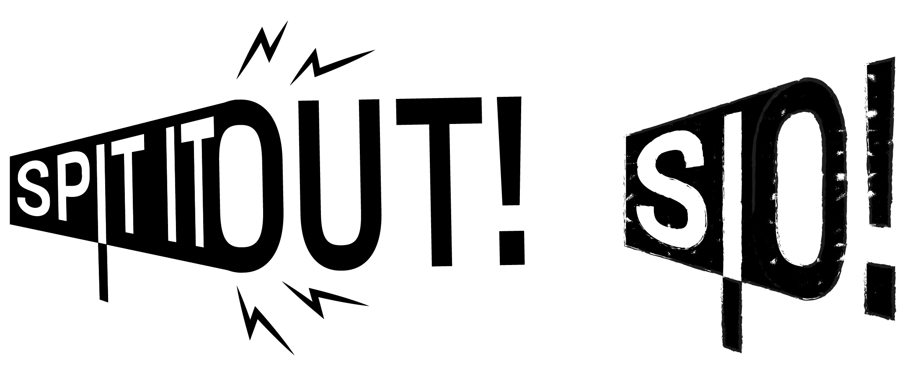
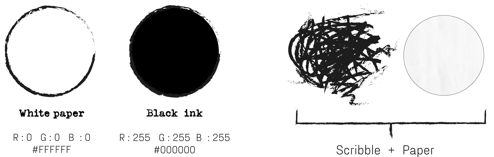
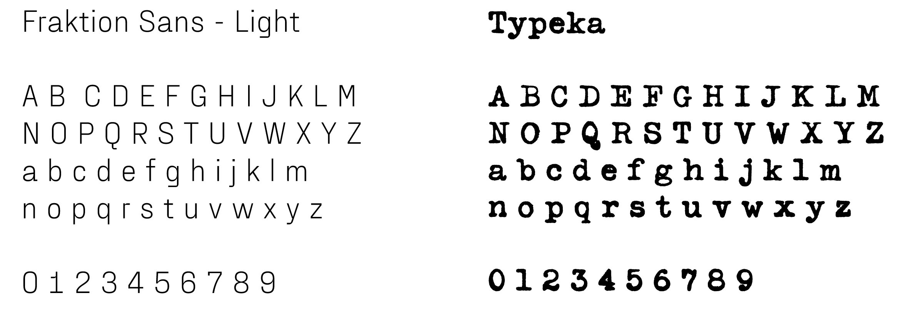
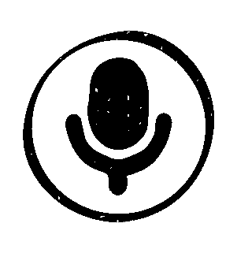

  

### Team members:
-  Brambilla Chiara
-  Crippa Alessandra
-  Moreschi Jessica
-  Repetto Matteo

### Course
[Creative Coding 2019/2020](https://drawwithcode.github.io/2020/) 
**Politecnico di Milano** - Scuola del Design 
**Faculty:** Michele Mauri, Andrea Benedetti, Tommaso Elli.

## Concept

Our patience has been severely tested because of the lockdown implications. We faced a lot
of different problems, unexpected events and other things that have threatened our mental
integrity. But we can bring out the best from this situation: Now it’s your chance to tell
everyone how you’re feeling… through creativity!

We present you... **Spit It Out!**
"Spit It Out" is phrase used to incentive to say what you are really thinking (in italian
can be translated as “sputa il rospo”, “sputalo fuori”).

It's is a common space that presents a diary as collaborative canvas: people will create 
a masterpiece of “words traces”. Step by step, the site will ask some questions to the user 
in order to generate a “river of words”. The final result it’s an artwork in which all 
the bad and good feelings dance together.

The aim of the project is giving voice to deep feelings, whatever they are. Together users 
will create an amazing and unpredictable artwork that will be shaped by the interaction of 
each other.

The entire experience is designed to work on computer and the mic is required.

## Design Challenges

Different aspects have been useful in the development of the site's design.

(write here a list of challenges or something like that. probably the main challenges was to create a "diary")

### Inspirations

Here I have to write which sites/behance projects have been useful in order to choose the style.

### Visual identity

**Logo**  
The logo is composed of two aspects: the title of the site (Spit It Out) and a stylized megaphone, who
represents the voice (a key element of the experience). Another characteristic is the texture applied
on the logo, who gives a hand drawn look.

 

There are also two alternatives of the logo, one without textures and one more "shortened" with only 
the initial letters S.I.O.

 

**Palette and textures**  
The color palette is very simple, composed by only two main colors (black and white) which resembles ink
and paper. The two textures too were selected to remember paper and ink.

 

**Fonts**  
The site uses two different fonts: the one called "Fraktion Sans" is used in standard texts, the other one called "Typeka", instead, is used in titles and underlined words (and it recalls typewriter's letters).

 

**Animations**  
The last but not the least is the large use of animations. They have been realized to be used as hover (so they can be triggered by passing the mouse on it) or as simple visual effects (such as the titles of the sections). All these animations follow the previous rules of the visual identity.

         
   
   
   

 

### UX

An image could be useful in order to give an overview of the site's workflow.
Another littl UX for the recording and writing section of the diary (more specific functions
of the devices mouse + microphone).

## Code challenges

x. How save users's inputs. (firebase)
x. Recording users's speeches
